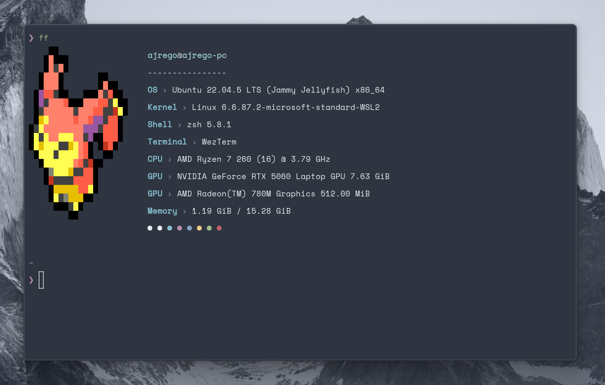
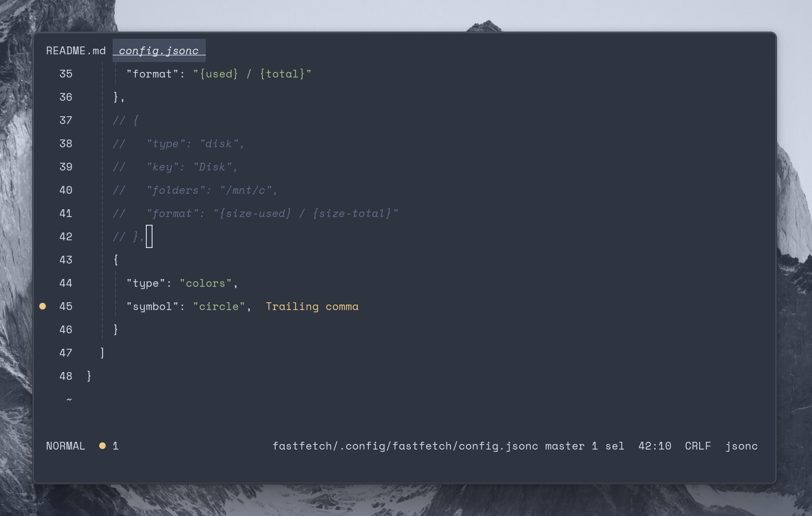
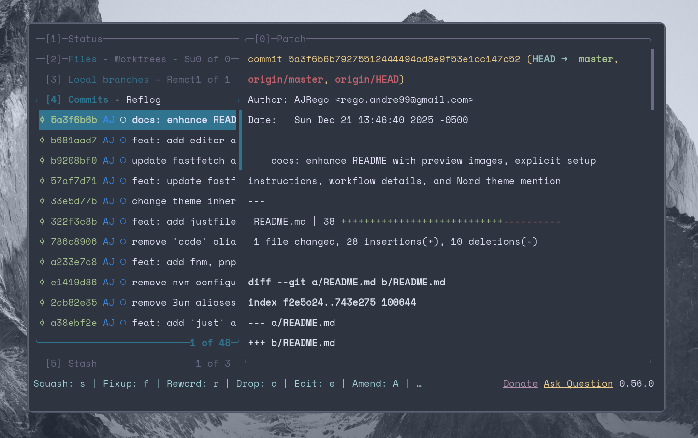

# Dotfiles

A configured environment for **WSL2 (Ubuntu 22.04 LTS)** on **Windows 11**

Focused on minimalism, performance, and a consistent **Nord** color palette

## Preview







## Setup

Configurations are managed via gnu stow + git

```sh
# clone repository
git clone https://github.com/ajrego/dotfiles.git ~/.dotfiles
cd ~/.dotfiles

# link configurations
stow zsh
stow git
stow helix
stow just
stow fastfetch
stow lazygit
```

## Workflow

Includes a `justfile` to automate common tasks and shortcuts for my daily workflow

## Status

Active work in progress. Optimizing for a fullstack development workflow on WSL
